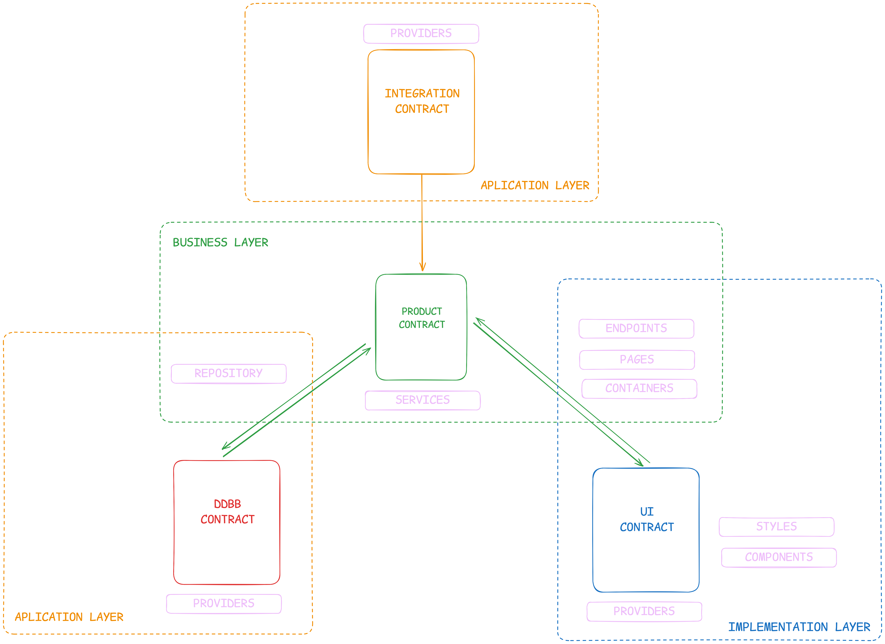

<h1 style="display: flex; align-items: center; gap: 10px;">Mas Alla de Clean Architecture: un modelo pragmatico para escalar software real</h1>

Read in English: [`README.en.md`](./README.en.md)

## Por que existe este modelo

Muchas conversaciones de arquitectura parten de un escenario ideal: alcance estable, tiempo de sobra y equipos hiper especializados. La mayoria de empresas no opera asi.

En la practica, casi siempre estamos en uno de estos contextos:

- Consultorias que entregan rapido con fechas muy exigentes.
- Startups que pivotan seguido y necesitan una arquitectura que absorba cambios.
- Productos maduros donde mantener y evolucionar pesa mas que reinventar.

En los tres casos, los problemas suelen repetirse:

- Muy simple: velocidad al inicio, caos despues.
- Muy rigido: pureza tecnica, baja velocidad de entrega.
- Muy complejo: onboarding lento y friccion constante.

Este modelo nace como punto medio: suficiente orden para escalar y suficiente simplicidad para adoptar.

## Idea central

El modelo se apoya en tres reglas operativas:

- Contexto por Ruta: el path explica por que existe un archivo.
- Conciencia de Alcance: cada archivo tiene un impacto predecible.
- Escalabilidad Horizontal: crecer agregando piezas enfocadas, no inflando archivos nucleares.

Estas reglas reducen la fatiga de decisiones y hacen los cambios mas seguros.

## Tres capas logicas

Todo sistema orientado al negocio equilibra tres capas:

1. Capa de Negocio: reglas propias de la empresa y comportamiento del producto.
2. Capa de Implementacion: ejecucion ligada al stack (web, API, mobile).
3. Capa de Aplicacion: integraciones con bases de datos, cache, SDKs y terceros.

No se trata de dogma estricto. Se trata de mantener responsabilidades claras a medida que crece el codigo.

## Interfaces como contratos

Las interfaces marcan fronteras limpias entre capas:

- Interfaz de Producto: adapta salidas de negocio para APIs y clientes.
- Interfaz de Datos: traduce detalles de persistencia para la capa de negocio.
- Interfaz de UI: convierte informacion de dominio en modelos para vista.

En proyectos pequenos estas fronteras pueden ser livianas. En sistemas grandes, reforzarlas evita acoplamientos caros.

## Ejemplo practico de estructura (Next.js + DB + Redis)

Dentro de `/src`:

- `pages/`: rutas de implementacion con composicion controlada de negocio.
- `containers/`: comportamiento de UI, flujos de interaccion y wiring de casos de uso.
- `components/`: presentacion pura, reutilizable y sin logica de negocio.
- `providers/`: integraciones externas (SDKs, cache, APIs de terceros).
- `services/`: decisiones de negocio y orquestacion de dominio.
- `repositories/`: estrategias de lectura y escritura de datos.

Asi se separan responsabilidades del stack y del negocio sin perder velocidad.

## Ejemplo de impacto de cambios

Solicitud: "Agregar alertas de vencimiento de trial en el dashboard de usuario".

Patron esperado de archivos:

- `services/subscription/...`: definir reglas de alerta.
- `repositories/subscription/...`: obtener datos de expiracion.
- `containers/dashboard/...`: decidir cuando y donde mostrar alertas.
- `components/alerts/...`: renderizar la UI de aviso.

Como el alcance de cada capa es explicito, puedes estimar efectos secundarios antes de codificar.

## Comparacion con enfoques comunes

- MVC / por capas: rapido para arrancar, suele derivar en ownership difuso.
- Clean / Hexagonal: limites muy buenos, a veces demasiado peso para equipos que iteran rapido.
- Implementaciones muy cargadas de DDD: modelado potente, pero pueden sobredisenar antes de validar producto.
- Este modelo: prioriza alineacion con negocio con estructura suficiente para escalar.

## Cuando este modelo no es la mejor opcion

- Prototipos desechables sin horizonte de mantenimiento.
- Sistemas altamente regulados con requisitos formales muy estrictos.
- Equipos con arquitectura actual estable y metricas de entrega saludables.

## Conclusiones

Una buena arquitectura debe acelerar la entrega, no frenarla.

Este modelo apuesta por escalabilidad practica: rutas claras, alcance explicito y crecimiento modular. Permite iterar rapido sin esconder complejidad que luego bloquee la evolucion del producto.

## Ejemplo real

- Portfolio (Next.js + MongoDB + Redis + OpenAI): [Repositorio en GitHub](https://github.com/adrihle/portfolio)
